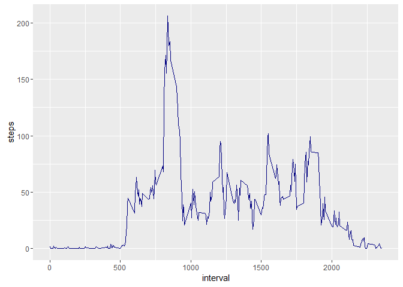
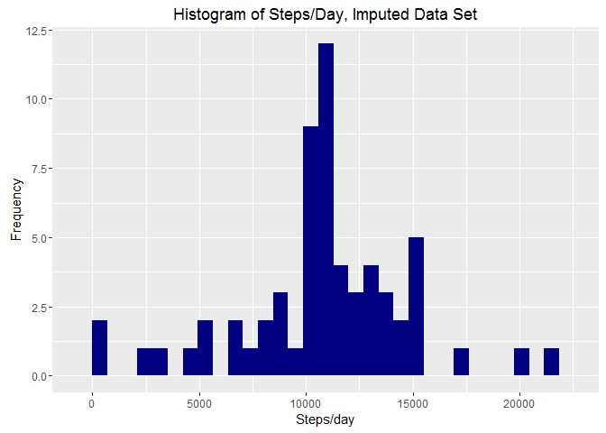

# Reproducible Research: Peer Assessment 1


## Loading and preprocessing the data

Setting up the environment


```r
library(knitr)
opts_chunk$set(echo=TRUE)
```

First, load the libraries.

```r
library(ggplot2)
library(dplyr)
```

```
## 
## Attaching package: 'dplyr'
```

```
## The following objects are masked from 'package:stats':
## 
##     filter, lag
```

```
## The following objects are masked from 'package:base':
## 
##     intersect, setdiff, setequal, union
```

```r
library(knitr)
library(lubridate)
```

Next, change to my local working directory. I have everything on a D: under various directories. Change this to your own.

```r
setwd("D:\\data\\Rprojects\\RResearch_Project1")
```

Read data set first and tidy up the date data

```r
data <- read.csv("activity.csv", header=TRUE, sep=",")
data$date <- ymd(data$date)
```


## What is mean total number of steps taken per day?

1. Calculate the total number of steps taken per day.


```r
steps <- data %>%
     filter(!is.na(steps)) %>%
     group_by(date) %>%
     summarize(steps = sum(steps))
```

2. Make a histogram of the total number of steps taken per day.


```r
ggplot(steps, aes(x=steps)) + 
     geom_histogram(fill="navyblue") + labs(x="# of Steps", y="Frequency")
```

```
## `stat_bin()` using `bins = 30`. Pick better value with `binwidth`.
```

\

3. Calculate and report on the mean and median of the total number of steps taken per day.


```r
avg_steps <- mean(steps$steps, na.rm=TRUE)
median_steps <- median(steps$steps, na.rm=TRUE)
max_steps <- max(steps$steps, na.rm=TRUE)

avg_steps
```

```
## [1] 10766.19
```

```r
median_steps
```

```
## [1] 10765
```

```r
max_steps
```

```
## [1] 21194
```


## What is the average daily activity pattern?

Create a time series plot (i.e. type = "l) of the 5-minute interval (x-axis) and the average number
of steps taken, averaged across all days. 

1. First create the interval.


```r
interval <- data %>%
          filter(!is.na(steps)) %>%
          group_by(interval) %>%
          summarize(steps = mean(steps))
```

2. Create the plot now.


```r
ggplot(interval, aes(x=interval, y=steps)) +
     geom_line(color="navyblue")
```

\

3. Which 5-minue interval that, on average, contains the maximum number of steps


```r
i <- interval[which.max(interval$steps), ]
i
```

```
## Source: local data frame [1 x 2]
## 
##   interval    steps
##      (int)    (dbl)
## 1      835 206.1698
```


## Imputing missing values

Calculate and report the total number of missing values (coded as NA). The presense of missing days may introduce bias into some calculations or summaries of the data.

1. Calculate and report the total number of missing values in the data set. ()


```r
sum(is.na(data$steps))
```

```
## [1] 2304
```

2. Devise a strategy for filling in all of the missing values in the dataset. 
3. Create a new dataset that is equal to the original data set but with the missing data filled in.

I use the average number of steps within the same 5-minute interval to impute the missing values.
I also combined a few steps into this next section of code.


```r
imputed_data <- data
na_values <- is.na(imputed_data$steps)
avg_i <- tapply(imputed_data$steps, imputed_data$interval, mean, na.rm=TRUE, simplify = TRUE)

imputed_data$steps[na_values] <- avg_i[as.character(imputed_data$interval[na_values])]

imputed_data$steps[na_values] <- tapply(imputed_data$steps, imputed_data$interval, mean, na.rm=TRUE, simplify=TRUE)
```

Check to make sure the NAs are all gone.

```r
sum(is.na(imputed_data$steps))
```

```
## [1] 0
```

4. Make a histogram of the total number of steps taken each day and calculate and report the mean and median total number of steps taken per day. Do these values differ from the estimates from the first part of the assignment? What is the impact of imputing missing data on the estimates of the total daily number of steps?

First get the total # of steps taken each day from the imputed data set.


```r
all_steps <- imputed_data %>%
               filter(!is.na(steps)) %>%
               group_by(date) %>%
               summarize(steps = sum(steps)) %>%
               print
```

```
## Source: local data frame [61 x 2]
## 
##          date    steps
##        (time)    (dbl)
## 1  2012-10-01 10766.19
## 2  2012-10-02   126.00
## 3  2012-10-03 11352.00
## 4  2012-10-04 12116.00
## 5  2012-10-05 13294.00
## 6  2012-10-06 15420.00
## 7  2012-10-07 11015.00
## 8  2012-10-08 10766.19
## 9  2012-10-09 12811.00
## 10 2012-10-10  9900.00
## ..        ...      ...
```

Then make a histogram of the total number of steps taken each day after missing values are imputed.
I tend to go with the ggplot2 package for my plots wherever possible.


```r
ggplot(all_steps, aes(x=steps)) +
          geom_histogram(fill="navyblue") +
          labs(title="Histogram of Steps/Day, Imputed Data Set", x="Steps/day", y="Frequency")
```

```
## `stat_bin()` using `bins = 30`. Pick better value with `binwidth`.
```

\

Display the mean and then the median from the imputed dataset.

```r
imean <- mean(all_steps$steps, na.rm=TRUE)
imed <- median(all_steps$steps, na.rm=TRUE)

imean
```

```
## [1] 10766.19
```

```r
imed
```

```
## [1] 10766.19
```

Note: The impact of imputing the data results in a mean and median of the same value: 10766.19 steps.


## Are there differences in activity patterns between weekdays and weekends?

1. Create a new factor variable in the dataset with two levels - "weekday" and "weekend" indicating whether a given date is a weekday or weekend day.
2. Make a panel plot comparing the average number of steps taken per 5-minute interval across weekdays and weekends

Here's the new factor variable:


```r
final <- mutate(imputed_data, weektype= ifelse(weekdays(imputed_data$date) == "Saturday" | weekdays(imputed_data$date) == "Sunday", "weekend", "weekday"))
final$weektype <- as.factor(final$weektype)
head(final)
```

```
##       steps       date interval weektype
## 1 1.7169811 2012-10-01        0  weekday
## 2 0.3396226 2012-10-01        5  weekday
## 3 0.1320755 2012-10-01       10  weekday
## 4 0.1509434 2012-10-01       15  weekday
## 5 0.0754717 2012-10-01       20  weekday
## 6 2.0943396 2012-10-01       25  weekday
```

Determine the mean # of steps taken per 5-minute interval across weekdays and weekends.


```r
avg_final <- final %>%
          group_by(interval, weektype) %>%
          summarize(steps = mean(steps))
```

...and make the plot using ggplot!


```r
ggplot(avg_final, aes(interval, steps, color = weektype)) +
          geom_line(color="red1") +
          facet_wrap(~weektype, ncol=1, nrow=2) +
          labs(title="Weekday/Weekend Differences during various Intervals", x="Interval", y="# of Steps")
```

\

From the results of this graph, it appears as though there are some distinct differences between weekday and
weekend activity. During the week, this person looks like they go out for some activity in the morning, and then 
the remainder of the day has much less activity.  Most of the activity occurrs on the weekend days.


.. and here's some interesting information not required within the assignment...

The mean # of steps taken for a weekday and the a weekend, for a 5-minute interval..


```r
aggregate(steps ~ weektype, final, mean)
```

```
##   weektype    steps
## 1  weekday 35.61058
## 2  weekend 42.36640
```


This concludes the data analysis.


